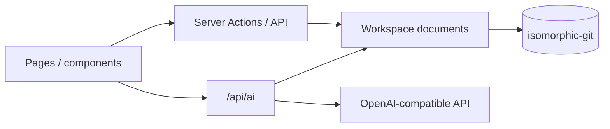

# Project Overview

Resume Pro is a **local-first**, open-source AI resume editor: manage multiple resumes, preview templates, improve content with AI, and score fit against saved job descriptions (JDs).

## Tech stack

| Layer | Technology |
|-------|------------|
| Framework | Next.js 16 (`output: "standalone"`) |
| UI | React 19, Tailwind CSS 4 |
| Language | TypeScript |
| ORM | Drizzle ORM |
| Database | SQLite (default), optional Postgres |
| AI | AgentScope (assistant) + LangChain (job match) + OpenAI-compatible API |
| Desktop | Electron 39 |
| Tests | Vitest |

## Top-level layout

```
resume-pro/
├── src/
│   ├── app/              # Next.js App Router: pages and API
│   ├── components/       # React components
│   ├── lib/              # Business logic (db, resume, ai, i18n, …)
│   └── templates/        # Resume HTML/React templates
├── electron/             # Electron main process and preload
├── drizzle/              # Drizzle migrations (sqlite / postgres)
├── scripts/              # Build and release-notes scripts
├── public/               # Static assets
└── docs/                 # This directory
```

## Core data flow



Resume and JD documents and AI chat sessions live under `WORKSPACE_PATH` (see
[workspace.md](./workspace.md)). A legacy database is only needed to run
`npm run workspace:migrate`.

## Major features

1. **Resume CRUD** — Create from the home page; structured node editing; PATCH persistence.
2. **Template preview** — Six built-in templates; dedicated print/PDF download page.
3. **AI assistant** — Chat (suggestions), Edit/Plan (streamed proposals that save only after confirmation).
4. **Job fit** — Save JDs, pick a resume, get a 0–10 score with strengths, gaps, and suggestions.
5. **i18n** — Eight locales; three UI themes (github / warm / slate).
6. **Electron** — Dev mode loads local Next; production bundles the standalone server.

## Environment variables (summary)

| Variable | Purpose |
|----------|---------|
| `DATABASE_PROVIDER` | Optional; only for `npm run workspace:migrate` from legacy DB |
| `SQLITE_PATH` | Legacy SQLite path for migration |
| `DATABASE_URL` | Legacy Postgres URL for migration |
| `WORKSPACE_PATH` | Workspace root for resumes / JDs / AI sessions |
| `AI_API_URL` / `AI_API_KEY` / `AI_API_MODEL` | OpenAI-compatible AI config |
| `APP_TARGET` / `ELECTRON` | Marks Electron runtime |

See `.env.example` and [README.md](../README.md) for full details.
